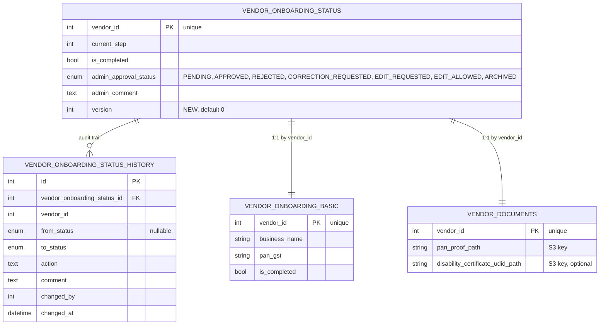
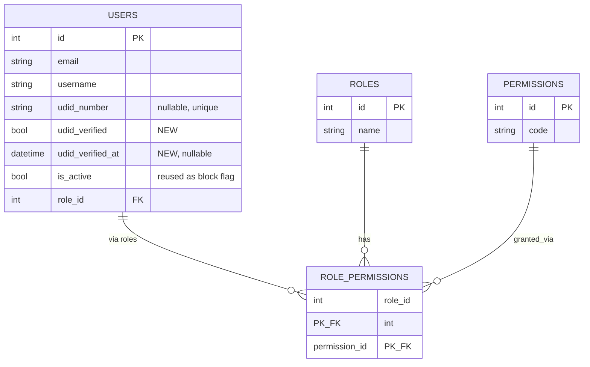
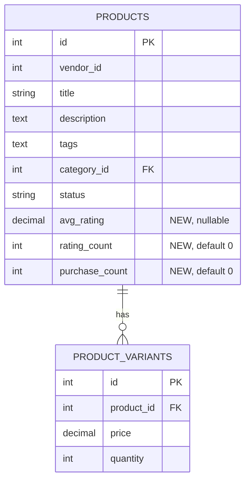
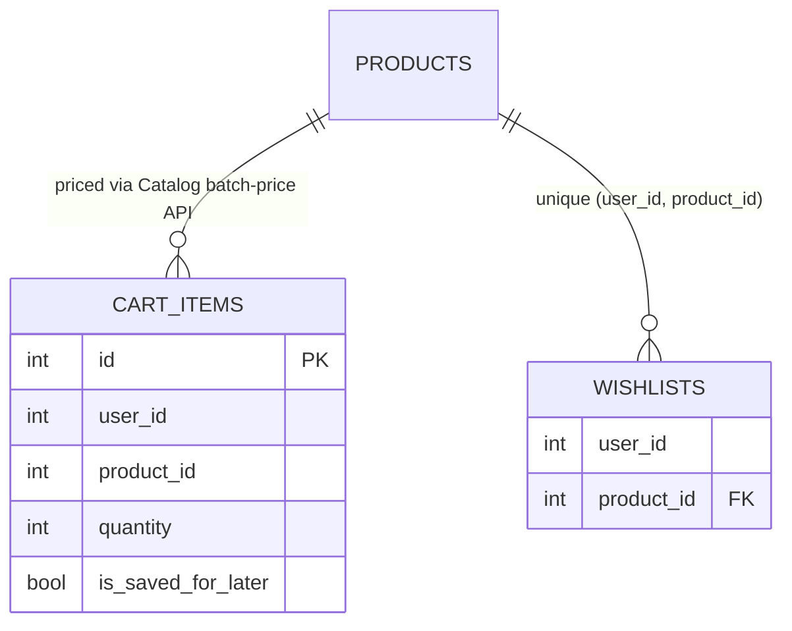

# Data Model — Entity Overview (Story-scoped: US-001, US-003, US-004, US-009)

> Full per-service schema detail lives in `.frontier/docs/architecture-documents/MartSarathi_HLD_LLD__1_.md` §3.2 and §15. This file tracks additive changes required by each story. Service-level detail for this story: [`docs/design/services/auth-service/data-model.md`](../design/services/auth-service/data-model.md).

## US-009 additive changes

> Service-level detail: [`docs/design/services/vendor-service/data-model.md`](../design/services/vendor-service/data-model.md).

The Vendor Service's schema (`sarthak_vendor_service` DB) is already fully specified in the HLD/LLD §10.2–10.3: six one-row-per-vendor onboarding form tables (`vendor_onboarding_basic`, `vendor_product_service`, `vendor_profile_inclusion`, `vendor_payment_compliance`, `vendor_documents`, `vendor_legal_compliance`), `vendor_onboarding_status`, the immutable `vendor_onboarding_status_history` audit table, and `user_local`. US-009 reuses all of it as-is, with one additive column:

| Table | Column | Type | Constraints | Description |
|---|---|---|---|---|
| `vendor_onboarding_status` | `version` | INT | NOT NULL, Default `0` | Optimistic-lock counter, incremented on every update — see [ADR-0003](adrs/0003-optimistic-locking-vendor-onboarding-concurrency.md) |

## Entity relationship (US-009 slice)



## Outbox events (new)

| Event | Trigger | Consumed by |
|---|---|---|
| `VENDOR_ONBOARDING_STATUS_CHANGED` | Any `vendor_onboarding_status.admin_approval_status` transition (Submitted/Approved/Rejected/Correction Required) | Notification Service ([US-008](../user-stories/stories/domain-notifications-support/US-008-notifications-and-support.md)) — vendor notification |

## Outbox consumption (new)

| Consumed event | Source service | Effect |
|---|---|---|
| `USER_CREATED` / `USER_UPDATED` | Auth Service | Upsert `user_local` row (existing Strategy 1 sync pattern, HLD/LLD §8.3) |

## Migration note (US-009)

Additive, nullable-safe migration (Vendor Service's first migration — all six form tables, status, and history tables from HLD/LLD §10.2–10.3 are created fresh alongside this column):

```sql
ALTER TABLE vendor_onboarding_status
  ADD COLUMN version INT NOT NULL DEFAULT 0;
```

## Ownership

`users`, `roles`, `permissions`, `role_permissions` are owned exclusively by the Auth Service (`sarthak_auth_service` DB). All other services store `user_id` as a logical (soft) reference only — no cross-service foreign keys, per the platform's database-per-service rule.

## Change required by US-001

The existing `users` table (HLD/LLD §3.2.1) already has `udid_number` (the submitted UDID) but no column tracking whether that UDID has been **verified** against the Sarthak Foundation endpoint. US-001's Gherkin AC ("on success the Buyer's profile is marked UDID-verified") requires this state.

### `users` table — additive columns

| Column | Type | Constraints | Description |
|---|---|---|---|
| `udid_verified` | BOOL | Default `False` | Whether `udid_number` has been confirmed against the Sarthak Foundation UDID endpoint |
| `udid_verified_at` | DATETIME(tz) | Nullable | Timestamp of successful verification |

No other schema changes are required — `is_active` (already in the table) is reused as the block/unblock flag consumed by this story's login check (set by US-014's Super Admin action), avoiding a redundant `is_blocked` column.

## Entity relationship (US-001 slice)



## US-003 additive changes

> Service-level detail: [`docs/design/services/catalog-service/data-model.md`](../design/services/catalog-service/data-model.md).

`products` (owned exclusively by the Catalog Service, `sarthak_catalog_service` DB, HLD/LLD §4.3.4) gains three denormalized, event-populated columns so US-003's filter/sort-by-rating and sort-by-popularity ACs never require a cross-service DB join:

| Column | Type | Constraints | Description |
|---|---|---|---|
| `avg_rating` | DECIMAL(3,2) | Nullable | Denormalized mean rating, updated by consuming `REVIEW_CREATED`/`REVIEW_UPDATED` events from the Review Service (US-007) |
| `rating_count` | INT | Default `0` | Denormalized count of ratings, updated alongside `avg_rating` |
| `purchase_count` | INT | Default `0` | Denormalized purchase count, updated by consuming `ORDER_PLACED` events from the Order Service |

A `FULLTEXT` index on `(title, description, tags)` supports keyword search relevance ranking (see [ADR-0002](adrs/0002-mysql-fulltext-for-product-search.md)).



## Outbox events (unchanged)

`USER_CREATED` and `USER_UPDATED` continue to fire on registration/profile changes per the existing Transactional Outbox pattern; UDID verification success also fires `USER_UPDATED` (with `udid_verified` in the payload) so downstream services (e.g. Checkout/Payment for sponsored-price eligibility) can react without a synchronous call back to Auth Service.

## US-004 additive changes

> Service-level detail: [`docs/design/services/cart-service/data-model.md`](../design/services/cart-service/data-model.md).

`cart_items` (owned exclusively by the Cart Service, `sarthak_cart_service` DB, HLD/LLD §5.2.1) requires **no schema change** for this story — the existing `id`, `user_id`, `product_id`, `quantity`, `is_saved_for_later` columns are sufficient for cart CRUD, and totals/feasibility are computed on read rather than stored. `wishlists` (owned exclusively by the Catalog Service, `sarthak_catalog_service` DB, HLD/LLD §4.3.5) is likewise unchanged — see [ADR-0004](adrs/0004-wishlist-ownership-cart-orchestration.md) for why wishlist data is not migrated to Cart Service.



No new outbox events are produced or consumed by this story beyond the existing `USER_CREATED`/`USER_UPDATED` sync into Cart Service's `user_local` table (HLD/LLD Strategy 1, unchanged).
