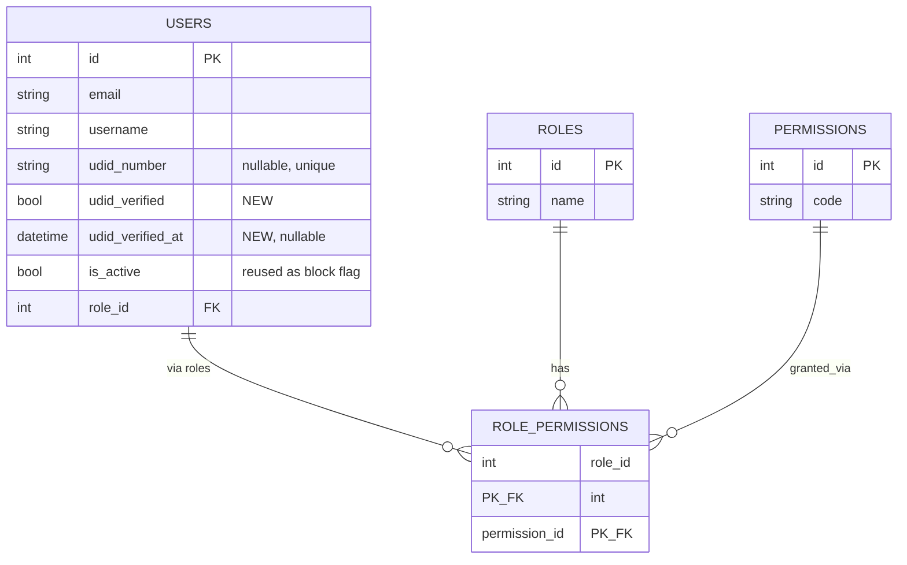

# Data Model — Entity Overview (Story-scoped: US-001)

> Full per-service schema detail lives in `.frontier/docs/architecture-documents/MartSarathi_HLD_LLD__1_.md` §3.2 and §15. This file tracks additive changes required by each story. Service-level detail for this story: [`docs/design/services/auth-service/data-model.md`](../design/services/auth-service/data-model.md).

## Ownership

`users`, `roles`, `permissions`, `role_permissions` are owned exclusively by the Auth Service (`sarthak_auth_service` DB). All other services store `user_id` as a logical (soft) reference only — no cross-service foreign keys, per the platform's database-per-service rule.

## Change required by US-001

The existing `users` table (HLD/LLD §3.2.1) already has `udid_number` (the submitted UDID) but no column tracking whether that UDID has been **verified** against the Sarthak Foundation endpoint. US-001's Gherkin AC ("on success the Buyer's profile is marked UDID-verified") requires this state.

### `users` table — additive columns

| Column | Type | Constraints | Description |
|---|---|---|---|
| `udid_verified` | BOOL | Default `False` | Whether `udid_number` has been confirmed against the Sarthak Foundation UDID endpoint |
| `udid_verified_at` | DATETIME(tz) | Nullable | Timestamp of successful verification |

No other schema changes are required — `is_active` (already in the table) is reused as the block/unblock flag consumed by this story's login check (set by US-014's Super Admin action), avoiding a redundant `is_blocked` column.

## Entity relationship (US-001 slice)

## Outbox events (unchanged)

`USER_CREATED` and `USER_UPDATED` continue to fire on registration/profile changes per the existing Transactional Outbox pattern; UDID verification success also fires `USER_UPDATED` (with `udid_verified` in the payload) so downstream services (e.g. Checkout/Payment for sponsored-price eligibility) can react without a synchronous call back to Auth Service.
