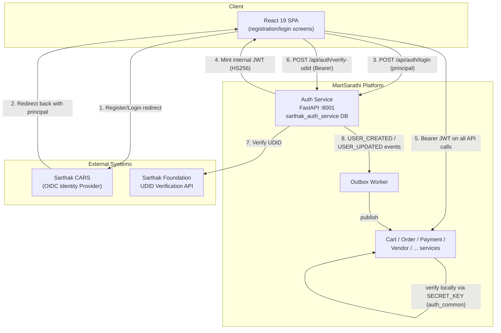

# C4 Level 2 — Containers (US-001 slice)

> Editable version: [`us-001-sso-registration-login.drawio.xml`](us-001-sso-registration-login.drawio.xml) (Draw.io). This mermaid version is the git-diffable source of truth for review; keep both in sync.

