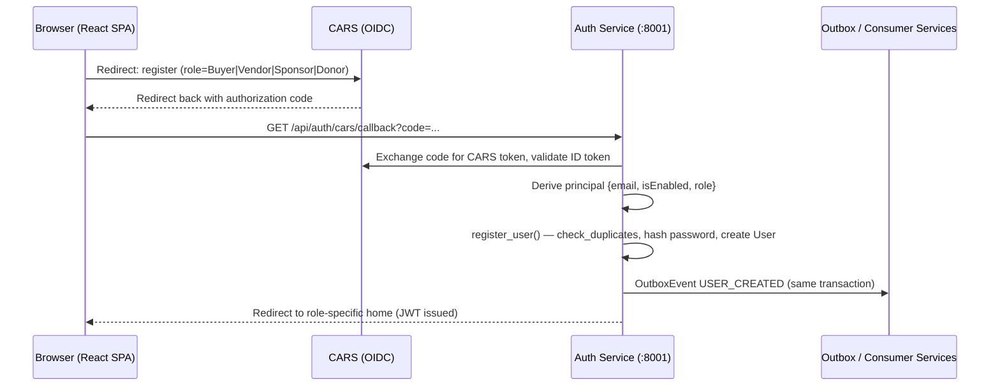
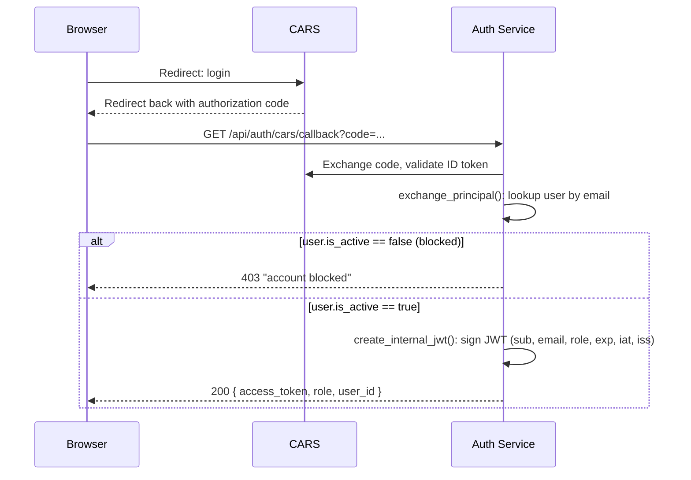
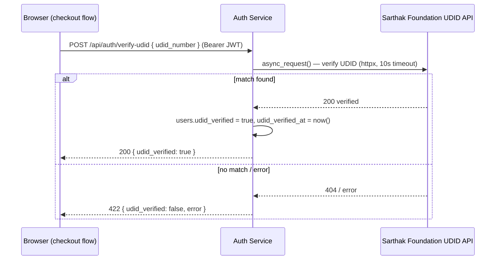

# Sequence Diagrams — US-001

## Registration (CARS SSO)

```mermaid
sequenceDiagram
    participant B as Browser (React SPA)
    participant C as CARS (OIDC)
    participant A as Auth Service (:8001)
    participant O as Outbox / Consumer Services

    B->>C: Redirect: register (role=Buyer|Vendor|Sponsor|Donor)
    C-->>B: Redirect back with authorization code
    B->>A: GET /api/auth/cars/callback?code=...
    A->>C: Exchange code for CARS token, validate ID token
    A->>A: Derive principal {email, isEnabled, role}
    A->>A: register_user() — check_duplicates, hash password, create User
    A->>O: OutboxEvent USER_CREATED (same transaction)
    A-->>B: Redirect to role-specific home (JWT issued)
```

## Login (existing + blocked-account check)

```mermaid
sequenceDiagram
    participant B as Browser
    participant C as CARS
    participant A as Auth Service

    B->>C: Redirect: login
    C-->>B: Redirect back with authorization code
    B->>A: GET /api/auth/cars/callback?code=...
    A->>C: Exchange code, validate ID token
    A->>A: exchange_principal(): lookup user by email
    alt user.is_active == false (blocked)
        A-->>B: 403 "account blocked"
    else user.is_active == true
        A->>A: create_internal_jwt(): sign JWT (sub, email, role, exp, iat, iss)
        A-->>B: 200 { access_token, role, user_id }
    end
```

## Post-login UDID verification (new for this story)

```mermaid
sequenceDiagram
    participant B as Browser (checkout flow)
    participant A as Auth Service
    participant S as Sarthak Foundation UDID API

    B->>A: POST /api/auth/verify-udid { udid_number } (Bearer JWT)
    A->>S: async_request() — verify UDID (httpx, 10s timeout)
    alt match found
        S-->>A: 200 verified
        A->>A: users.udid_verified = true, udid_verified_at = now()
        A-->>B: 200 { udid_verified: true }
    else no match / error
        S-->>A: 404 / error
        A-->>B: 422 { udid_verified: false, error }
    end
```
