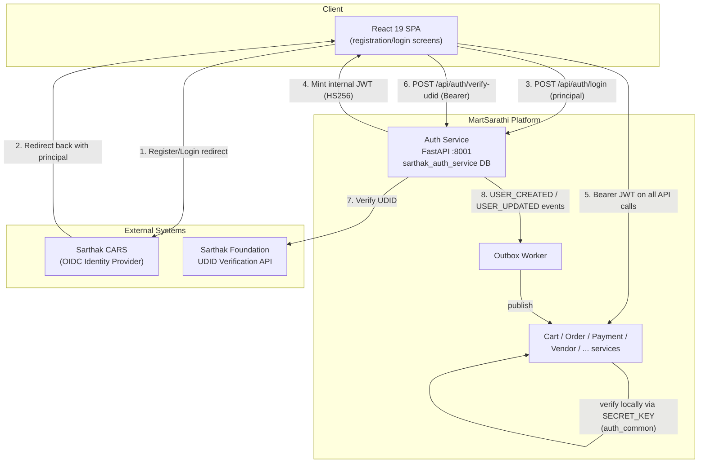

# System Design — MartSarathi (Story-scoped: US-001)

> Full platform architecture is defined in `.frontier/docs/architecture-documents/MartSarathi_HLD_LLD__1_.md`. This file tracks the **incremental architecture contribution** required by each story, starting with [US-001](../user-stories/stories/domain-registration-auth/US-001-sso-registration-login.md) (Jira [CP-16](https://ateequrrahaman2004.atlassian.net/browse/CP-16)).

## Scope for this story

US-001 owns `services/auth-service/` (port 8001, DB `sarthak_auth_service`). It contributes two changes on top of the existing Auth Service design (HLD/LLD §3, §6.3.1, §11):

1. A new **UDID verification** capability (post-login, not just at registration) that calls the external Sarthak Foundation UDID endpoint.
2. Explicit **blocked-account rejection** semantics on `/login`, consumed by [US-014](../user-stories/stories/domain-platform-admin/US-014-platform-administration-controls.md)'s Super Admin block/unblock action.

Everything else (JWT issuance, `auth_common` RBAC middleware, role/permission model) already exists per the HLD/LLD and is reused as-is — see `docs/architecture/adrs/0001-cars-sso-principal-exchange.md` for the one architecture decision this story required.

## C4 — Level 2: Containers (US-001 slice)

## Sequence overview

Full sequence diagrams: `docs/architecture/diagrams/sequence/seq-sso-login-udid-verification.md`.

## FR / NFR traceability

| Component | Serves |
|---|---|
| CARS OIDC redirect + principal exchange | FR-01-01, FR-01-02, FR-01-04 |
| JWT issuance + `auth_common` RBAC middleware (existing) | FR-01-03, NFR "centralized RBAC" |
| UDID verification endpoint + Sarthak Foundation client | FR-01-05, FR-01-06 |
| Password reset (existing `/reset-password`, CARS-hosted primary path) | FR-01-07 |
| Blocked-account rejection on `/login` | FR-01-08, FR-01-09 |

## Open question

The HLD/LLD documents the Auth Service's `/login` endpoint as accepting a `principal` object (`AuthService.exchange_principal()`), implying CARS SSO is completed externally (browser redirect to CARS, then a principal handed back) before MartSarathi's backend ever runs. The exact mechanism by which the frontend/backend obtains that `principal` from CARS's OIDC callback (authorization-code exchange location, token validation responsibility) is not fully specified in the source HLD/LLD. This is captured as ADR-0001 with `Proposed` status — confirm with the CARS integration owner before implementation.
