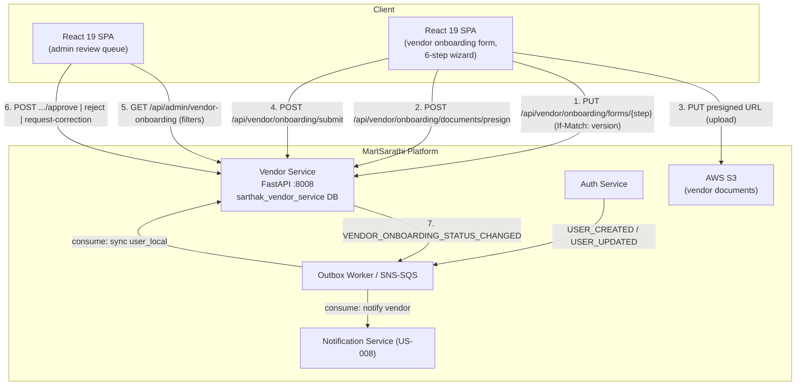
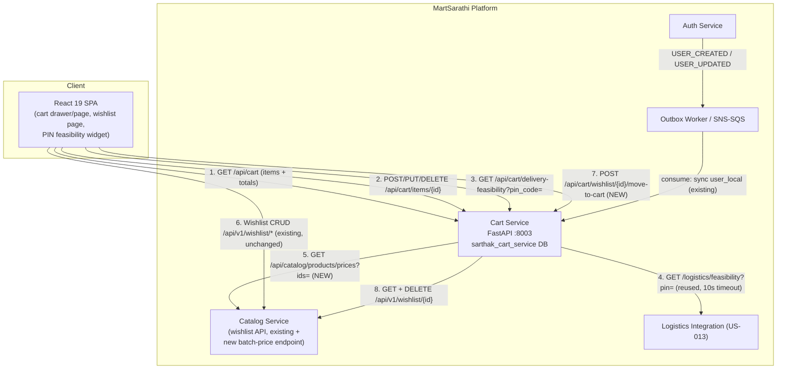
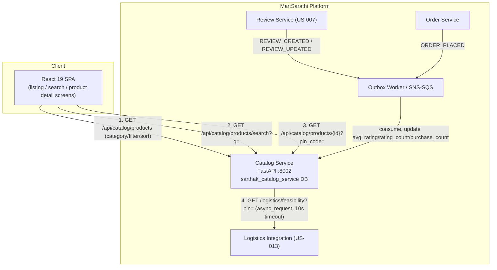
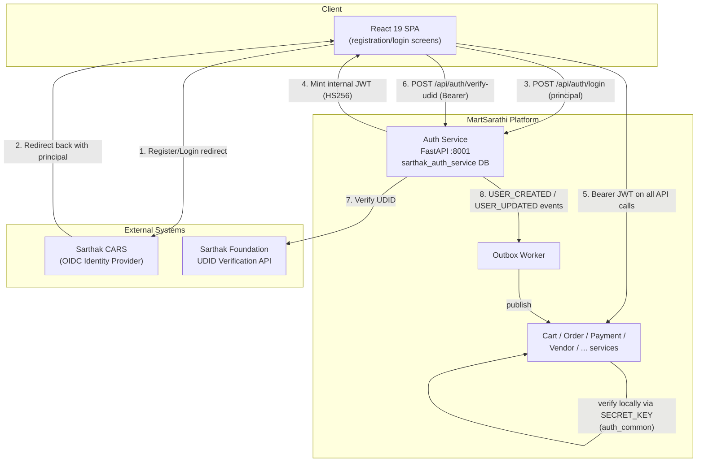

# System Design — MartSarathi (Story-scoped: US-001, US-003, US-004, US-009)

> Full platform architecture is defined in `.frontier/docs/architecture-documents/MartSarathi_HLD_LLD__1_.md`. This file tracks the **incremental architecture contribution** required by each story, starting with [US-001](../user-stories/stories/domain-registration-auth/US-001-sso-registration-login.md) (Jira [CP-16](https://ateequrrahaman2004.atlassian.net/browse/CP-16)).

## Scope for US-009 (Jira [CP-24](https://ateequrrahaman2004.atlassian.net/browse/CP-24))

[US-009](../user-stories/stories/domain-vendor-onboarding/US-009-vendor-onboarding-workflow.md) stands up the **Vendor Service** (port 8008, DB `sarthak_vendor_service`), owning `services/vendor-service/onboarding/`. This is the first story to implement this service — unlike US-001/US-003, which extended already-running Auth/Catalog services, the Vendor Service's schema and lifecycle are already fully specified in the HLD/LLD (§6.3.8, §10.2–10.3) but not yet built. US-009's architecture contribution is therefore: stand up the service against the existing schema, plus one new capability (concurrency control) the HLD/LLD does not cover.

1. **6-step onboarding form APIs** — draft save/resume and metadata endpoints over the existing `vendor_onboarding_basic` / `vendor_product_service` / `vendor_profile_inclusion` / `vendor_payment_compliance` / `vendor_documents` / `vendor_legal_compliance` tables (HLD/LLD §10.2), each keyed uniquely by `vendor_id`.
2. **Document upload** via the existing `ecom_core.utils.storage.S3Service` presigned-URL abstraction (NFR-02: 1-hour expiry, no public bucket access) — no new storage component.
3. **Submission gating** — server-side mandatory-field/document check before transitioning `vendor_onboarding_status` from `PENDING` (Draft) to `Submitted`, reusing the state machine already defined in HLD/LLD §10.3.
4. **Admin review queue + actions** (Approve/Reject/Request Correction) over `vendor_onboarding_status` + the immutable `vendor_onboarding_status_history` audit table (HLD/LLD §10.3) — both already specified, reused as-is.
5. **Notify-vendor hook** — every status transition emits `VENDOR_ONBOARDING_STATUS_CHANGED` via the standard Transactional Outbox pattern, consumed by the Notification Service ([US-008](../user-stories/stories/domain-notifications-support/US-008-notifications-and-support.md)) to email/in-app-notify the vendor.
6. **Concurrency control (new, not in HLD/LLD)** — NFR-04 requires supporting concurrent vendor submissions and real-time validation. See [ADR-0003](adrs/0003-optimistic-locking-vendor-onboarding-concurrency.md): an additive `version` column on `vendor_onboarding_status` with conditional updates, returning `409` on a stale write instead of introducing DB row locking.
7. **`user_local` sync** — Vendor Service consumes `USER_CREATED`/`USER_UPDATED` events from the Auth Service outbox to populate its local `user_local` table (existing Strategy 1 cross-service sync pattern, HLD/LLD §8.3) — no new pattern.

### C4 — Level 2: Containers (US-009 slice)

### FR traceability (US-009)

| Component | Serves |
|---|---|
| 6-step onboarding form APIs + draft save/resume | FR-09-01, FR-09-02, FR-09-03 |
| Submission gating (mandatory field/document check) | FR-09-04 |
| Vendor status view + admin remarks | FR-09-05 |
| Correction-required edit/resubmit + resubmission history | FR-09-06 |
| Admin review queue (filters: status, date, category) | FR-09-07 |
| Admin vendor profile/document viewer | FR-09-08 |
| Approve / Reject / Request Correction actions + notify-vendor hook | FR-09-09 |
| `vendor_onboarding_status_history` audit trail | FR-09-10 |
| Optimistic locking (ADR-0003) + field-level validation | FR-09-11, NFR-04 |
| S3 presigned upload (1-hour expiry, no public access) | NFR-02 |

### Degraded-mode behaviour

Not applicable — this story has no synchronous external dependency (S3 uploads and the Notification Service outbox are both already covered by the platform's existing retry/async patterns); a Notification Service outage delays the vendor-facing email but does not block the onboarding/review workflow itself.

## Scope for US-004 (Jira [CP-19](https://ateequrrahaman2004.atlassian.net/browse/CP-19))

[US-004](../user-stories/stories/domain-cart-wishlist/US-004-cart-wishlist-management.md) owns `services/cart-service/` (port 8003, DB `sarthak_cart_service`). The existing Cart Service already implements plain CRUD (add/update/remove, `is_saved_for_later`) over `cart_items` (HLD/LLD §5). This story adds three capabilities on top:

1. **Cart totals** — `GET /api/cart` now returns each item enriched with live price (via a new Catalog Service batch-price endpoint, since `cart_items` stores no price) plus a computed `totals` block: `subtotal`, `tax`, `delivery_charge`, `grand_total`. Recalculation is implicit — totals are derived on every read/mutation response, never cached, so "recalculates immediately" (AC) requires no extra invalidation logic.
2. **Delivery feasibility by PIN** — `GET /api/cart/delivery-feasibility?pin_code=` delegates to the same Logistics integration contract US-003 already established ([US-013](../user-stories/stories/domain-logistics/US-013-logistics-partner-integration.md)), reusing the identical degraded-mode fallback (`unknown` on timeout/unavailable) rather than defining a second integration pattern.
3. **Wishlist → cart move** — a new orchestration endpoint, `POST /api/cart/wishlist/{wishlist_id}/move-to-cart`. Wishlist data itself is **not** migrated to Cart Service — see [ADR-0004](adrs/0004-wishlist-ownership-cart-orchestration.md): it stays owned by Catalog Service (`wishlists` table, existing `/api/v1/wishlist/*` API), and Cart Service calls that existing API synchronously to read then delete the wishlist row while writing its own `cart_items` row.

**New upstream dependency on Catalog Service:** `GET /api/catalog/products/prices?ids=1,2,3` (batch price lookup) is a small new endpoint Catalog Service must add to support cart-total enrichment without an N+1 call pattern — analogous to how US-003 depended on the Logistics integration owned by a different story.

### C4 — Level 2: Containers (US-004 slice)

### FR traceability (US-004)

| Component | Serves |
|---|---|
| Cart CRUD (add/update/remove) — existing, reused | FR-04-01 |
| Total calculation (tax + delivery, recalculated on every read/mutation) | FR-04-02 |
| Delivery-feasibility-by-PIN endpoint (reuses US-013 Logistics contract) | FR-04-03 |
| Wishlist CRUD (existing, Catalog Service) | FR-04-04 |
| Move-to-cart orchestration (ADR-0004) | FR-04-05 |

### Degraded-mode behaviour

If the Logistics feasibility call times out or the endpoint is unavailable, `GET /api/cart/delivery-feasibility` still returns `200` with `feasibility: "unknown"` — identical fallback to US-003's product-detail endpoint, per the platform's degraded-mode NFR. If the Catalog Service batch-price call fails, `GET /api/cart` still returns the cart items with `price: null` and `totals: null` rather than failing the whole request (a Buyer can still see/edit cart contents when Catalog Service is briefly unavailable).

## Scope for US-003 (Jira [CP-18](https://ateequrrahaman2004.atlassian.net/browse/CP-18))

[US-003](../user-stories/stories/domain-product-discovery/US-003-product-discovery-search.md) owns `services/catalog-service/discovery/` (port 8002, DB `sarthak_catalog_service`). It adds a read/browse surface on top of the existing Catalog Service `product` module (HLD/LLD §4.3.4):

1. **Category listing + filter/sort API** — paginated browse over the existing `products`/`product_variants` tables, filterable by category, price range, brand, and rating, sortable by price/recency/popularity.
2. **Keyword search API** — relevance-ranked full-text search using MySQL 8.0+ `FULLTEXT` indexes (no new search infra — stays within the platform's approved stack; see [ADR-0002](adrs/0002-mysql-fulltext-for-product-search.md)).
3. **Product detail API** — aggregates price breakdown (basic/discounted/tax/delivery), stock, specs, and a delivery-feasibility check delegated to the Logistics integration owned by [US-013](../user-stories/stories/domain-logistics/US-013-logistics-partner-integration.md).
4. **Two new denormalized, event-populated columns** on `products` (`avg_rating`/`rating_count` from Review Service events, `purchase_count` from Order Service events) so filtering/sorting never requires a cross-service DB join, per the platform's database-per-service rule.

### C4 — Level 2: Containers (US-003 slice)

### FR traceability (US-003)

| Component | Serves |
|---|---|
| Category/listing API with pagination | FR-03-01 |
| Keyword search (MySQL FULLTEXT relevance ranking) | FR-03-02 |
| Filter/sort query parameters (price, brand, rating, category, recency, popularity) | FR-03-03 |
| Product detail API (price breakdown, specs, stock, delivery feasibility) | FR-03-04, FR-03-05, FR-03-06 |

### Degraded-mode behaviour

If the Logistics feasibility call (US-013) times out or the endpoint is unavailable, the product detail response still returns with `delivery_feasibility: "unknown"` rather than failing the whole request — consistent with the platform's NFR that services operate at reduced capacity under partial failure instead of failing completely.

## Scope for US-001

US-001 owns `services/auth-service/` (port 8001, DB `sarthak_auth_service`). It contributes two changes on top of the existing Auth Service design (HLD/LLD §3, §6.3.1, §11):

1. A new **UDID verification** capability (post-login, not just at registration) that calls the external Sarthak Foundation UDID endpoint.
2. Explicit **blocked-account rejection** semantics on `/login`, consumed by [US-014](../user-stories/stories/domain-platform-admin/US-014-platform-administration-controls.md)'s Super Admin block/unblock action.

Everything else (JWT issuance, `auth_common` RBAC middleware, role/permission model) already exists per the HLD/LLD and is reused as-is — see `docs/architecture/adrs/0001-cars-sso-principal-exchange.md` for the one architecture decision this story required.

## C4 — Level 2: Containers (US-001 slice)

## Sequence overview

Full sequence diagrams: `docs/architecture/diagrams/sequence/seq-sso-login-udid-verification.md`.

## FR / NFR traceability

| Component | Serves |
|---|---|
| CARS OIDC redirect + principal exchange | FR-01-01, FR-01-02, FR-01-04 |
| JWT issuance + `auth_common` RBAC middleware (existing) | FR-01-03, NFR "centralized RBAC" |
| UDID verification endpoint + Sarthak Foundation client | FR-01-05, FR-01-06 |
| Password reset (existing `/reset-password`, CARS-hosted primary path) | FR-01-07 |
| Blocked-account rejection on `/login` | FR-01-08, FR-01-09 |

## Open question

The HLD/LLD documents the Auth Service's `/login` endpoint as accepting a `principal` object (`AuthService.exchange_principal()`), implying CARS SSO is completed externally (browser redirect to CARS, then a principal handed back) before MartSarathi's backend ever runs. The exact mechanism by which the frontend/backend obtains that `principal` from CARS's OIDC callback (authorization-code exchange location, token validation responsibility) is not fully specified in the source HLD/LLD. This is captured as ADR-0001 with `Proposed` status — confirm with the CARS integration owner before implementation.
