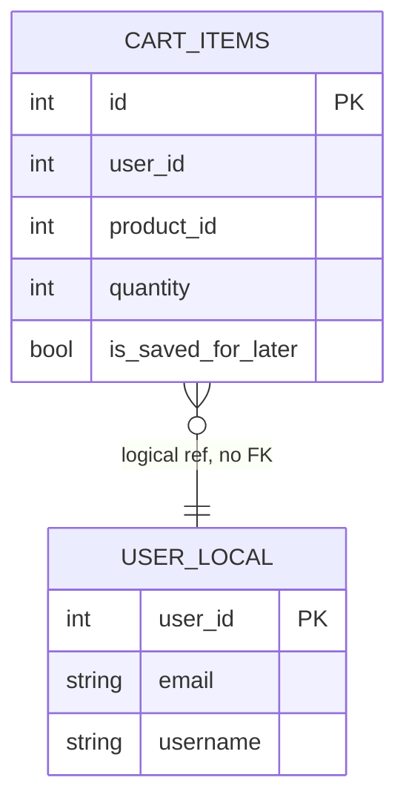

# Cart Service — Data Model (US-004 contribution)

> Cross-cutting entity overview: [`docs/architecture/data-model.md`](../../../architecture/data-model.md#us-004-additive-changes). This file is the Cart Service team's owned detail.

## `cart_items` table — no changes

| Column | Type | Constraints | Description |
|---|---|---|---|
| `id` | INT | PK, Auto-increment | Existing |
| `product_id` | INT | NOT NULL, Indexed | Existing |
| `quantity` | INT | Default 1, NOT NULL | Existing |
| `user_id` | INT | NOT NULL | Existing |
| `is_saved_for_later` | BOOL | Default False, NOT NULL | Existing |
| `created_at` / `updated_at` | DATETIME(tz) | Server default `NOW()` | Existing |

Existing indexes reused: `idx_cart_user_saved (user_id, is_saved_for_later)`, `uq_cart_user_product (user_id, product_id, is_saved_for_later)`.

No migration is required for this story — price, tax, delivery charge, and feasibility are all computed at request time from other services' data, never stored in `cart_items`. Storing a denormalized price would risk staleness against Catalog Service's actual price (discounts/sponsorship can change independently of the cart), which the story's ACs do not ask for.

## `wishlists` table — unchanged, owned by Catalog Service

Reference only (no FK, no cross-service DB access) — see [`docs/design/services/catalog-service/data-model.md`](../catalog-service/data-model.md) for the authoritative definition. Cart Service reads/deletes rows in this table exclusively through Catalog Service's `/api/v1/wishlist/*` API, per [ADR-0004](../../../architecture/adrs/0004-wishlist-ownership-cart-orchestration.md).

## Entity relationship (US-004 slice)

## Outbox consumption (unchanged)

| Consumed event | Source service | Effect |
|---|---|---|
| `USER_CREATED` / `USER_UPDATED` | Auth Service | Upsert `user_local` row (existing Strategy 1 sync pattern) |

No new outbox events are produced or consumed by this story. Totals, feasibility, and the move-to-cart orchestration are all synchronous read/write operations against existing tables — nothing here requires eventual-consistency handling.
