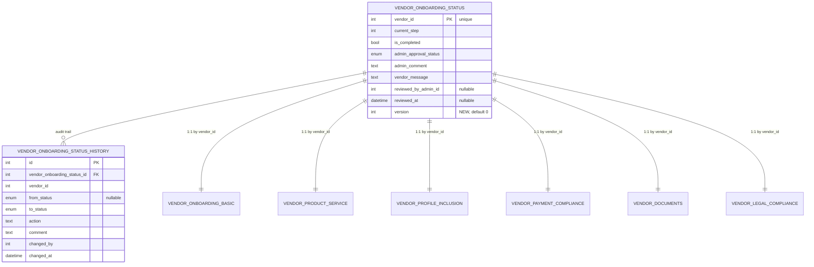

# Vendor Service — Data Model (US-009 contribution)

> Cross-cutting entity overview: [`docs/architecture/data-model.md`](../../../architecture/data-model.md#us-009-additive-changes). This file is the Vendor Service team's owned detail.

## Tables (all HLD/LLD §10.2–10.3, built fresh for this story)

| Table | Key | Purpose |
|---|---|---|
| `vendor_onboarding_basic` | `vendor_id` unique | Form 1 — business name, PAN/GST, contact, address |
| `vendor_product_service` | `vendor_id` unique | Form 2 — product category, target user group, compliance, ISO/CE/ISI certificate |
| `vendor_profile_inclusion` | `vendor_id` unique | Form 3 — Udyam/UAM registration, PwD ownership/workforce data, 12A/80G/FCRA certificates |
| `vendor_payment_compliance` | `vendor_id` unique | Form 4 — bank/UPI details, government ID, cancelled cheque, TDS category |
| `vendor_documents` | `vendor_id` unique | Form 5 — PAN proof, disability certificate/UDID, business registration, brand/trademark documents |
| `vendor_legal_compliance` | `vendor_id` unique | Form 6 — consent/accuracy/guidelines/data-privacy/returns-policy confirmations (all boolean) |
| `vendor_onboarding_status` | `vendor_id` unique | `current_step` (1–6), `is_completed`, `admin_approval_status`, `admin_comment`, `vendor_message`, `reviewed_by_admin_id`, `reviewed_at` |
| `vendor_onboarding_status_history` | `id` PK, FK → `vendor_onboarding_status.id` | Immutable audit trail: `from_status`, `to_status`, `action`, `comment`, `changed_by`, `changed_at` |
| `user_local` | `user_id` unique | Denormalized user record, synced from Auth Service `USER_CREATED`/`USER_UPDATED` events |

Full column-level detail for every table above: HLD/LLD §10.2–10.3.

## `vendor_onboarding_status` — additive column (this story)

| Column | Type | Constraints | Description |
|---|---|---|---|
| `version` | INT | NOT NULL, Default `0` | Optimistic-lock counter — see [ADR-0003](../../../architecture/adrs/0003-optimistic-locking-vendor-onboarding-concurrency.md) |

Every write to this row uses `UPDATE vendor_onboarding_status SET ..., version = version + 1 WHERE vendor_id = :vid AND version = :expected_version`. Zero rows affected → `409`.

## Onboarding status state machine (HLD/LLD §10.3, unchanged)

```
START → PENDING ──→ APPROVED (vendor can trade)
                 ├─→ REJECTED (must re-apply)
                 └─→ CORRECTION_REQUESTED → (vendor edits) → PENDING
Post-Approval:
    APPROVED → EDIT_REQUESTED → EDIT_ALLOWED → (vendor edits) → PENDING
Any State:
    * → ARCHIVED (by admin)
```

`Submitted` (per US-009's Gherkin AC) maps to `admin_approval_status = PENDING` with `vendor_onboarding_status.is_completed = True` — the HLD/LLD's `PENDING` state covers "awaiting admin action," which includes both "not yet submitted" (`is_completed = False`) and "submitted, awaiting review" (`is_completed = True`); the API layer surfaces this distinction as `Draft` vs. `Submitted`/`Under Review` without a separate DB enum value.

## Entity relationship (US-009 slice)



## Migration note

Vendor Service's first migration creates all tables in HLD/LLD §10.2–10.3 fresh, plus the additive `version` column:

```sql
ALTER TABLE vendor_onboarding_status
  ADD COLUMN version INT NOT NULL DEFAULT 0;
```

No backfill required — this is the service's initial schema.

## Outbox (new)

| Direction | Event | Payload | Notes |
|---|---|---|---|
| Produced | `VENDOR_ONBOARDING_STATUS_CHANGED` | `vendor_id`, `from_status`, `to_status`, `comment`, `changed_at` | Consumed by Notification Service |
| Consumed | `USER_CREATED` / `USER_UPDATED` | Auth Service's standard user payload | Upserts `user_local` (Strategy 1 sync, HLD/LLD §8.3) |
